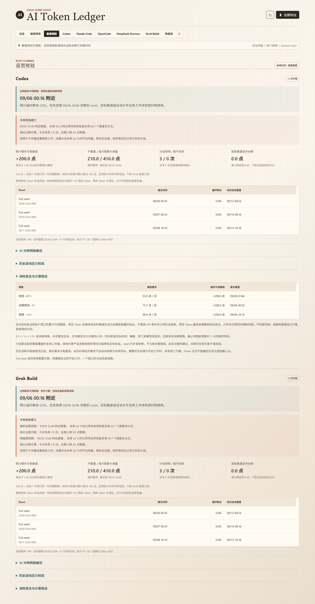
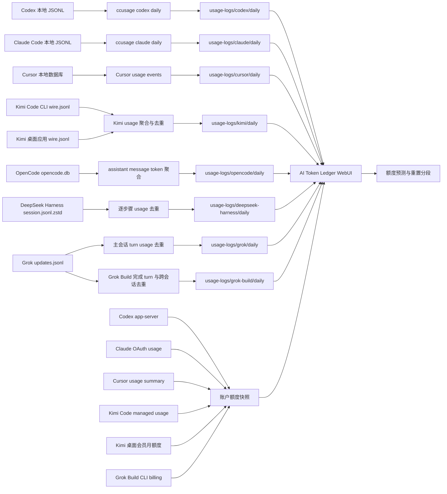

# AI Token Ledger

> 面向 Windows 的本地 AI 编程助手用量仪表盘，集中展示 Codex、Claude Code、Cursor、Kimi、OpenCode、DeepSeek Harness、Grok 本地用量与 Grok Build 的 token 消耗、账户额度、重置时间和耗尽预测。

`AI Token Ledger` 将本机日志和账户额度快照集中到一个本地仪表盘中。程序直接读取本地文件，不依赖数据库；usage JSON、每日导出和 `npx` 缓存均保存在项目目录中。

## 界面预览

以下截图来自本地聚合数据示例；数值会随账户和日志变化，截图不包含凭证、cookie 或账户 ID。

### 总览

所有已注册智能体的累计用量、按 2026-09-10 官方 API 单价估算的近 30 日费用、模型分布、每日 Token 热力图、趋势、重置额度与每日明细集中在一页。


### Cursor Pro 额度预测

Cursor 页面使用设置页同口径的 `Included in Pro` 总百分比，并保留 `Auto + Composer` 与 `API` 分项。旧计划单位仅作为诊断数据保存，不计入 Pro 额度预测。


### Kimi 额度预测

Kimi 页面分别展示会员月总额度和 Kimi Code 周额度。两个窗口各自记录已用比例、重置时间、观测分段和耗尽预测，月度窗口还显示 Kimi / Code 构成。凭证由后端读取。5 小时窗口保存在原始账户快照中，不进入预测页。


### OpenCode 本地用量

OpenCode 页面直接汇总本地 SQLite 中的 assistant token 字段，按 `provider/model` 区分不同后端，并保留非缓存输入、缓存读写、输出、推理与费用。采集器不会读取或导出对话正文。


### DeepSeek Harness 本地用量

DeepSeek Harness 页面只读扫描本地 `session.jsonl.zstd`，按会话、推理步骤和模型聚合 usage。流式 usage 会被同一步骤的最终 usage 替换，推理 token 作为输出子项单列，不重复计入总 token。


### Grok 本地用量

Grok 页面汇总当前 Windows 用户在本机运行 Grok CLI 产生的主会话记录。统计按日期和模型展示普通输入、缓存读写、输出与推理 token，不读取账号总用量。

### Grok Build 本地用量

Grok Build 页面读取官方 CLI 会话中的 `turn_completed.usage`，自动拆分非缓存输入、缓存输入、输出和推理 token，并按模型汇总实际费用。恢复或分叉会话产生的重复 turn 会被去重，真实子代理调用仍会保留。额度预测页同步官方共享周池的已用百分比和重置时间，banked reset 只读展示可用次数与到期时间。


### 数据源显示设置

齿轮按钮可以选择导航、总览和预测页中关注的 Provider。隐藏只改变页面展示，后台全量刷新和历史快照仍会继续维护所有已注册来源。


### Banked reset 规划

根据当前额度、自然恢复日期、每张 reset 的到期时间和历史 Token 消耗，给出重置顺序与预计增益。近期需求不足以用完库存时，还可展开“有更多待办时”查看参考日均工作量与对应安排。

规划现已使用动态规划，显示时间网格最优性与连续时间上界，并加入“今天优先续工”和历史波动压力检验。它不会把未来需求当成已知事实。


以下额外待办和续工截图使用**模拟账户数据**，用于展示不同需求下的安排，不是实际账户收益：




### 新版本提示

程序确认 GitHub 远端分支领先本地版本后显示更新横幅。关闭横幅后，同一远端版本不再重复提示。


### 移动端

手机端保留完整功能，顶部导航支持横向滚动，页面主体保持在视口范围内。


## 功能

| 能力 | 说明 |
| --- | --- |
| 多来源用量账本 | 分别展示 Codex、Claude Code、Cursor、Kimi Code、OpenCode、DeepSeek Harness、Grok 本地用量与 Grok Build；总览由后端注册表动态聚合。 |
| 每日快照 | Codex / Claude Code / all-agent 使用 `ccusage`；Cursor 汇总 usage events；Kimi 汇总 `wire.jsonl`；OpenCode 汇总 SQLite；DeepSeek Harness 汇总 Zstandard 会话计量事件；Grok 汇总本地主会话，Grok Build 汇总完成 turn。 |
| 日历热力图 | 总览按天展示最近最多 53 周的 Token 用量，颜色深浅反映各活跃日的相对用量。 |
| 官方额度窗口 | 同步 Codex、Claude Code、Cursor、Kimi 与 Grok Build 的当前已用比例、剩余额度、账期或重置时间。 |
| 统一刷新 | 顶部刷新和“全部导出”会刷新全部已注册本地 token 与账户额度源。 |
| 重点来源 | 可自行选择出现在导航、总览和预测页的 Provider；隐藏不停止后台刷新。 |
| 耗尽预测 | 结合今日实时速度以及近 3 日、7 日速度，估计当前额度窗口的耗尽时间。 |
| 模型等效 Token | 样本足够时，根据官方额度变化估计模型权重；API 价格不参与订阅额度换算。 |
| API 费用估算 | 按 2026-09-10 各厂商官方 API 单价，从本地 Token 构成估算费用。Kimi 与 DeepSeek 保留人民币价，其余为美元；历史记录按当前价卡重算。 |
| 日内重置识别 | 上午用完额度、午间重置、下午继续使用时，重置前后的 Token 会自动分段，避免污染拟合。 |
| 重置 credits | Codex 与 Grok Build 页可显示 banked reset 的可用次数与本地时区有效期；不会在仪表盘内消耗。 |
| 重置规划 | 对比等待自然恢复与使用 reset 的可支持 Token，展示逐张时间表、丢弃余额、三种消耗情景，以及有更多待办时的参考工作量。 |
| 新版本提示 | 页面打开时静默检查 GitHub；只有远端 `main` 严格领先本地提交时才显示可关闭提示。 |
| 定时导出 | Windows 计划任务默认每天中午 12:00 运行。 |

## 快速开始

### 1. 检查运行环境

当前项目面向 Windows 10/11，建议使用 Node.js 22.15 或更高版本、PowerShell，以及已经登录的 Codex / Claude Code / Cursor。Node 22.15 是读取 DeepSeek Harness Zstandard 会话日志所需的最低版本。Kimi 官方桌面应用和 Kimi Code CLI 的本地 token 都可读取；会员月总额来自已登录的 Kimi 桌面应用，周额度来自已登录的 Kimi Code CLI。OpenCode、DeepSeek Harness、Grok 本地用量与 Grok Build 是可选来源，生成对应本地记录后即可读取。

```powershell
node --version
npx --version
```

本项目使用当前维护的 `ccusage` 命令。导出脚本优先调用 `PATH` 中已安装的 `ccusage`，以减少刷新时的启动等待；若系统中没有该命令，则使用项目缓存运行 `npx -y ccusage@latest`。可按下面的命令全局安装：

```powershell
npm install -g ccusage@latest
ccusage --version

# 未全局安装时使用 npx
npx -y ccusage@latest codex daily --help
npx -y ccusage@latest claude daily --help
npx -y ccusage@latest daily --help
```

Kimi 是可选来源。使用官方桌面应用时，每日 token 来自其中的 Kimi Code 日志，会员月总额及 Kimi / Code 构成来自桌面应用登录态。Kimi Code 周额度需要安装 CLI 并完成登录。登录凭证由客户端保管，无需手动填写到项目中。

```powershell
npm install -g @moonshot-ai/kimi-code
kimi login
```

OpenCode 默认读取[官方数据目录](https://opencode.ai/docs/troubleshooting/#storage)中的 `opencode.db`：

```powershell
Test-Path "$HOME\.local\share\opencode\opencode.db"
```

若数据库位于自定义目录，可在启动仪表盘前设置 `OPENCODE_DB_PATH`。OpenCode 可以连接多个模型 Provider，因此本项目只汇总本地 token 与费用，不虚构一个跨 Provider 的统一订阅额度窗口。

DeepSeek Harness 默认读取当前机器上的：

```powershell
Test-Path "D:\deepseek-harness\.dsh-home\sessions"
```

自定义安装可在启动仪表盘或执行导出前设置路径。`DEEPSEEK_HARNESS_SESSION_ROOT` 优先级最高；也可设置 Harness 项目根目录或 home：

```powershell
$env:DEEPSEEK_HARNESS_ROOT = "D:\deepseek-harness"
$env:DEEPSEEK_HARNESS_HOME = "D:\deepseek-harness\.dsh-home"
$env:DEEPSEEK_HARNESS_SESSION_ROOT = "D:\deepseek-harness\.dsh-home\sessions"
```

默认只统计路由标识为 `deepseek` 或 `deepseek-official` 的调用，避免把 Harness 中转到其他厂商的模型误记为 DeepSeek。确有自定义 DeepSeek 路由时，可用逗号分隔覆盖：

```powershell
$env:DEEPSEEK_HARNESS_PROVIDER_IDS = "deepseek,deepseek-official,my-deepseek-gateway"
```

Grok 默认从当前用户目录读取 CLI 和会话记录：

```powershell
Test-Path "$HOME\.grok\bin\grok.exe"
Test-Path "$HOME\.grok\sessions"
```

自定义安装可设置 `GROK_HOME`、`GROK_CLI_PATH` 或 `GROK_SESSION_ROOT`。Grok 数据源不调用账号用量接口，适合共享账号下分别统计各台电脑的本地 CLI 使用量。

Grok Build 默认读取官方 CLI 的 `~/.grok/sessions/**/updates.jsonl`。先运行一次 Grok Build 并完成至少一个 turn：

```powershell
grok --version
Test-Path "$HOME\.grok\sessions"
```

自定义 home 或会话目录可在启动和导出前设置。`GROK_BUILD_SESSION_ROOT` 优先于 `GROK_HOME`：

```powershell
$env:GROK_HOME = "D:\grok-home"
$env:GROK_BUILD_SESSION_ROOT = "D:\grok-home\sessions"
```

两个来源默认读取同一会话目录，但采用不同聚合口径。两者同时显示时，总览按 Provider 分组只计入一个 Grok 用量来源；各自页面仍保留完整明细，Grok Build 的共享额度和 reset 信息也可单独查看。

### 2. 导出第一份数据

```powershell
cd "path\to\codex_token_visualization"
npm run export
```

也可以直接运行 PowerShell 脚本：

```powershell
powershell -NoProfile -ExecutionPolicy Bypass -File .\scripts\export-all-daily.ps1
```

### 3. 打开仪表盘

双击项目根目录中的 `打开仪表盘.bat`，或在 PowerShell 中运行：

```powershell
powershell -NoProfile -ExecutionPolicy Bypass -File .\scripts\open-dashboard.ps1
```

启动脚本默认使用 `8787` 端口。该端口上如有本项目的 Node 进程，脚本会先重启进程；如由其他程序占用，脚本会提示改用其他端口。

浏览器地址：<http://127.0.0.1:8787>

开发时也可以直接启动：

```powershell
npm start
```

## 工作原理



点击顶部刷新或“全部导出”时，系统执行：

1. 从后端注册表读取标记为自动导出的 `ccusage` 来源，并行导出 Codex 与 Claude Code 用量。
2. 同步 Codex、Claude Code、Cursor、Kimi Code 与 Grok Build 的账户额度，并导出 OpenCode、DeepSeek Harness、Grok 本地用量和 Grok Build 完成 turn。
3. 记录去重后的分段观测点。
4. 重新读取当前页面，各标签页使用同一轮数据。

页面总览直接合并各 Provider 快照，`all` 聚合快照不参与计算。自动刷新只生成 Codex 和 Claude Code 的独立快照；旧工作流需要聚合 JSON 时可手动运行 `npm run export:all`。

## 页面说明

| 页面 | 内容 |
| --- | --- |
| `总览` | 全部已注册来源的整体比较、总趋势、按官方 API 单价估算的费用、可滚动模型分布、价表和每日总账。 |
| `额度预测` | 全部支持额度同步的 Provider 的剩余额度、重置时间、速度与耗尽预测。 |
| `重置规划` | 支持 banked reset 的来源的使用建议；与总览使用同一套数据源显示选择。 |
| `Codex` | Codex 的每日趋势、缓存构成、费用、模型、快照、reset credits。 |
| `Claude Code` | Claude Code 的每日趋势、缓存构成、费用、模型、快照。 |
| `Cursor` | Cursor usage events 汇总的独立 token 使用明细。 |
| `Kimi` | Kimi `usage.record` 的本地 token 明细、会员月额度构成和周额度。 |
| `OpenCode` | OpenCode assistant 消息的本地 token、费用和 `provider/model` 分布；不生成不存在的统一额度预测。 |
| `DeepSeek Harness` | Harness 会话中实际路由到 DeepSeek 的逐日 token、缓存、输出、推理与模型分布；不读取正文，也不虚构账户额度。 |
| `Grok` | 当前用户在本机运行 Grok CLI 产生的逐日 token 和模型分布；账号总用量不进入本地账本。 |
| `Grok Build` | Grok Build 完成 turn 的逐日 token、缓存、输出、推理、费用与模型分布，以及共享周额度和 banked reset 到期时间。 |
| `齿轮` | 选择显示在导航、总览和预测中的 Provider；至少保留一个，设置保存在本地。 |
| `数据源` | 日志目录、检测状态、每日快照和额度观测点数量。 |

页面首次打开时读取已有 JSON。右上角的刷新按钮用于重新导出并载入最新数据。

页面通过本地 `/api/update-status` 调用 [GitHub Compare API](https://docs.github.com/en/rest/commits/commits#compare-two-commits)。远端 `main` 严格领先本地提交时显示更新提示，查询结果缓存 5 分钟。网络、API 或 Git 状态不可用时不显示提示。关闭提示后，程序会记录对应的远端提交，后续版本更新时再显示。

## 数据源与账户同步

| 来源 | 本地 token 数据 | 账户额度数据 | 自动周期 |
| --- | --- | --- | --- |
| Codex | `ccusage codex daily --json` | 本机 `codex app-server` 的 `account/rateLimits/read` | 周级及以上窗口；更短窗口只保留在原始快照 |
| Claude Code | `ccusage claude daily --json` | 本机 Claude OAuth 登录态请求 usage 窗口 | 7 天总额，以及接口实际开放的 Opus、Sonnet、Fable 等周级模型窗口 |
| Cursor | 最近 90 天 Cursor usage events 聚合 | Cursor usage summary | Cursor 账期、Included in Pro、Auto + Composer、API |
| Kimi | CLI `~/.kimi-code/sessions/**/wire.jsonl` + 桌面应用嵌入式 Kimi Code `sessions/**/wire.jsonl` | Kimi 会员 subscription stats + Kimi Code managed usage | 会员月总额及 Kimi / Code 构成、周额度与各自重置时间 |
| OpenCode | `~/.local/share/opencode/opencode.db` 中的 assistant token 字段 | 无统一账户口径 | 不生成额度窗口 |
| DeepSeek Harness | `.dsh-home/sessions/**/session.jsonl.zstd` 中的 usage 事件 | 未发现可验证的本机统一额度接口 | 不生成额度窗口 |
| Grok | `~/.grok/sessions/**/updates.jsonl` 中主会话的 `turn_completed` usage | 不读取账号额度 | 不生成额度窗口 |
| Grok Build | `~/.grok/sessions/**/updates.jsonl` 中的 `turn_completed.usage` | 官方 CLI `_x.ai/billing` + Grok Web 只读 reset RPC | Grok 共享周池、重置时间、预付余额、banked reset |

### Codex

Codex 额度来自本机 CLI 的 app-server。浏览器只接收额度、reset credits 数量和有效期等汇总字段，登录 token 保留在本机进程中。

### Claude Code

Claude Code 的本地 token 明细来自 JSONL，额度窗口来自本机登录态。接口返回的 `utilization + resets_at` 对象会自动注册，预测页显示周期不少于一周的窗口。全模型周限额排在首位；账户接口返回有效数据时，再显示 Fable、Opus、Sonnet 等模型窗口。`modelPatterns` 用于统计模型专属窗口对应的本地 token。access token 临近过期或接口返回 401 时，后端会使用 Claude Code 的 refresh token 续期并原子写回轮换后的凭证。refresh token 被撤销或失效时，面板保留上一次成功快照，并提示运行 `claude auth login`。[Anthropic 的 Max 计划说明](https://support.claude.com/en/articles/11049741-what-is-the-max-plan)列出了全模型周限额和模型专属周限额。

### Cursor Pro

Cursor 的旧 `plan.used / plan.limit` 使用另一套计量单位。主要额度进度采用设置页中的 `Included in Pro` 总百分比，同时展示 `Auto + Composer`、`API` 和账期。旧单位保留为诊断数据，不参与 Pro 百分比预测。

### Kimi

Kimi token 明细来自 CLI 和官方桌面应用的本地会话。统计以 turn 级 `usage.record` 为准，分别汇总缓存读取、缓存写入、普通输入和输出。`session` 级汇总不重复计入；两套目录中的相同事件按时间、模型和 token 构成去重，主代理和子代理的独立调用分别保留。

桌面应用日志位于 `%APPDATA%\kimi-desktop\daimon-share\daimon\runtime\kimi-code\home\sessions`。会员月总额通过 Kimi Web 与桌面应用共用的 `GetSubscriptionStats` 接口读取，沿用桌面应用登录态。项目保存总已用比例、Code 占比和精确到时分的到期时间；“月度 Kimi”由总比例减去 Code 比例得到。Kimi Code 周额度来自 CLI managed usage 接口。CLI access token 过期后，程序通过官方 OAuth refresh 流程在本机刷新，并原子更新 Kimi 的凭证文件。

两套在线额度独立同步。没有安装 Kimi Code CLI 时，会员月总额仍可从桌面应用读取；桌面应用登录态不可用时，CLI 周额度仍可单独更新。在线查询失败不影响本地每日 token 导出，面板继续使用最近一次成功的额度快照。WebUI 和项目日志只接收汇总数据，不写入 token、cookie、完整账户 ID 或会话正文。[Kimi 会员额度规则](https://www.kimi.com/zh-cn/help/membership/membership-update-rules)说明月额度按订阅周期恢复；[Kimi Code 权益说明](https://www.kimi.com/zh-cn/help/kimi-code/benefits)列出了周额度和 5 小时滚动窗口。预测页采用周额度及更长周期的口径。

### DeepSeek Harness

采集器按 Harness 自己的持久化协议扫描由多个独立 Zstandard frame 拼接而成的会话文件。每个 `(session, turn, step)` 只保留最后一份 usage：正常完成时以 `assistant/message.usage` 为准；请求中断但已经产生 usage chunk 时保留该早期样本。总 token 按普通输入、输出、缓存读取和缓存写入相加，`reasoningTokens` 是输出的子项，只单独展示而不重复累加。

解析结果只含日期、Provider、模型和 token 数字。会话 ID、工作目录、请求头正文、用户消息、助手文本和工具内容均在解析时丢弃，不会写入 `usage-logs`。活动文件末尾若存在未完成 frame，会保留此前完整 frame 并跳过残缺尾部；单个损坏文件不会阻止其他会话统计，但所有文件均不可解码时导出会失败并保留旧账本。

DeepSeek Harness 目前作为纯本地用量来源接入。没有经过验证的官方账户额度百分比与重置时间接口，因此页面不会凭 token 数量伪造额度或耗尽预测。

### Grok

Grok 数据源扫描当前用户目录下的 `updates.jsonl`，提取主会话完成时写入的 usage。分叉会话中重复的 prompt 会被去重；子代理用量已经包含在主会话记录中，因此不再单独累加。Grok 的 ACP 输入字段包含缓存命中，输出字段包含推理 token，采集器会拆分这些子项，使页面构成之和保持与 Grok 记录的总 token 一致。

滚动账本保存日期、模型和 token 数字。提示词、回复、会话标题、工作目录、会话 ID、账号信息和费用字段不写入 `usage-logs`。该数据源不访问 `/usage` 或其他账号接口，共享账号中其他设备和其他用户的用量不会进入本机统计。

### Grok Build

Grok Build 采集器依据[官方会话持久化说明](https://github.com/xai-org/grok-build/blob/main/crates/codegen/xai-grok-pager/docs/user-guide/17-sessions.md)，递归扫描 `~/.grok/sessions` 下所有 `updates.jsonl`，只接受 `sessionUpdate: "turn_completed"` 的最终 usage。它不会使用 `signals.json` 中用于上下文恢复的 token 快照，也不会解析用户消息、助手正文或工具内容。[Grok Build 官方仓库](https://github.com/xai-org/grok-build)与[产品说明](https://x.ai/news/grok-build-cli)可用于核对 CLI 与本地会话格式。

xAI 的 `inputTokens` 含缓存输入，因此页面先减去 `cachedReadTokens` 和 `cacheCreationTokens`，再把剩余部分显示为“非缓存输入”；`reasoningTokens` 是输出的子项，只单列而不重复加入总 token。`costUsdTicks` 按固定点美元换算后保留在每日账本中。若同一个 prompt/model 因恢复、导入或分叉出现在多个会话文件中，只保留最新且最完整的一份；不同 prompt 的父会话和子代理调用都会计入。

额度刷新通过官方 CLI 的 `_x.ai/billing` 扩展完成，读取 `creditUsagePercent` 和 `currentPeriod`，不直接处理 CLI access token。[xAI FAQ](https://docs.x.ai/grok/faq)说明这是 Grok 各产品共享的周使用池，页面显示的百分比并非 Build token 的一对一比例；如果同一周期还使用 Grok Chat、Imagine、Voice 或 API，这些消耗也会推动周池百分比，拟合结果会如实反映这种混合行为。

banked reset 通过 Grok Web 自身的 `ConsumerUiSvc/GetRemainingResets` 只读 RPC 获取。仪表盘只保留可用数量和最早到期时间，reset token ID 在内存解析阶段丢弃，也不提供兑换按钮。点击顶部刷新会同时更新周额度、预测观测点和 banked reset；手动在 Grok 官方页面使用 reset 后，下一次刷新会检测已用比例下降或周期变化并开启新分段，旧周期拟合样本不会被删除。

持久化结果只含日期、模型、usage 数字、额度百分比和 reset 到期时间，不含 prompt ID、reset token ID、会话 ID、工作目录、对话正文或凭证。

## 额度预测：原始 Token、模型等效 Token 与重置

### 订阅额度与 API 价格

订阅额度的扣减受到模型、缓存命中、上下文规模和任务形态影响。仪表盘费用数字来自 [`web/billing.js`](web/billing.js) 中截至 2026-09-10 的公开 API 单价。Kimi 与 DeepSeek 按人民币计算，其他条目按美元计算。模型等效 Token 的权重仍由账户额度变化估计，不使用 API 单价。

价卡覆盖本机已经出现过的模型，以及各 Provider 当前可能写入账本的主要型号。缓存读取、缓存写入和输出分别计价；推理 token 是输出的子项，不重复计费。DeepSeek 采集器按每条请求的日志时间计算北京时间高峰价或空闲价。Grok、Gemini 和 OpenAI 的长上下文条件无法从日账本还原，因此使用标准价估算。价表和动态路由规则可通过 `/api/billing` 查看。

| 厂商或服务 | 当前模型路由 | 价格来源 |
| --- | --- | --- |
| OpenAI | `gpt-6-astra`、`gpt-5.6-sol` / `gpt-5.6`、`gpt-5.6-terra`、`gpt-5.6-luna` | [OpenAI API Pricing](https://developers.openai.com/api/docs/pricing) |
| Anthropic | `claude-fable-5-1`、`claude-opus-5`、`claude-sonnet-5`、`claude-haiku-4-5` | [Claude Pricing](https://platform.claude.com/docs/en/about-claude/pricing) |
| Kimi | 开放平台使用 `kimi-k3`、`kimi-k2.7-code`、`kimi-k2.6`；Kimi Code 使用 `k3`、`k3-256k`、`kimi-for-coding`、`kimi-for-coding-highspeed` | [Kimi 开放平台](https://platform.kimi.com/)；[Kimi Code 模型配置](https://www.kimi.com/code/docs/kimi-code/models.html) |
| DeepSeek | `deepseek-flash`；旧的 `deepseek-v4-flash` 路由已由 V4.1 Flash 提供服务；`deepseek-v4-pro` 将在北京时间 2026-09-14 12:00 转到 `deepseek-flash` | [DeepSeek 模型与价格](https://api-docs.deepseek.com/zh-cn/quick_start/pricing/) |
| xAI | `grok-4.6`、`grok-4.5`、`grok-4.3`、`grok-build-0.1` | [xAI API Pricing](https://docs.x.ai/developers/pricing) |
| Cursor | `composer-2.5`、各 Fast 变体；Router 的模型 ID 为 `auto-smart`，费用按实际选中的模型计算 | [Cursor Models & Pricing](https://cursor.com/docs/models-and-pricing)；[Cursor Available Models](https://prod.cursor.com/help/models-and-usage/available-models) |
| Google / Meta（Cursor） | `gemini-3.1-pro-preview`、`gemini-3.8-flash`、`muse-spark-1.3` | [Cursor Models & Pricing](https://cursor.com/docs/models-and-pricing) |

### 预测分层

| 阶段 | 条件 | 面板行为 |
| --- | --- | --- |
| 观察期 | 历史不足 2 个有效消耗区间 | 显示官方额度、重置时间、今日 / 3 日 / 7 日原始 Token 速度。 |
| 单变量拟合 | 历史累计至少 2 个有效区间，且通过近期模型覆盖和稳定组合检查 | 汇总保留期内各重置周期的 Token 增量和额度百分比增量，显示 `R²` 与预测耗尽时间。 |
| 模型等效 Token | 至少 7 个跨周期有效区间，且模型占比存在显著变化、近期主要模型已校准 | 使用带先验的岭回归学习正的模型相对权重，不把新模型限制在任意的 4 倍上限。 |

单变量拟合采用“分段固定起点”：每个额度周期只计算周期内部增量，避免把重置前后的百分比跳变计为消耗；同一种额度窗口的有效区间用于估计同一条消耗率。历史数据按 28 天半衰期逐渐降低权重，使近期使用情况对预测的影响更大。周额度、月额度和其他口径分别拟合；接口新增更长周期窗口后，系统会为该口径重新积累样本。异常区间通过稳健权重降低影响。

只有近期模型组合仍稳定且有足够对应样本时，系统才退回原始 Token 单斜率。模型变化、权重不可辨识或近期扣减偏差过大时，保留官方余额与历史记录，但暂停定量预测，不把“暂不可靠”显示成零消耗。

### 新模型与等效 Token 的含义

例如 GPT-6 Astra 的 [API 官方价格](https://developers.openai.com/api/docs/models/gpt-6-astra)区分输入、缓存、输出以及长上下文费率；[Codex 官方额度说明](https://learn.chatgpt.com/docs/pricing)还列出模型、推理、工具、上下文和缓存等影响因素。不能从一个 API 涨价倍数推导出固定的订阅额度倍数。

计算链路是：`各模型原始 Token → 从实际额度扣减学习的模型权重 → 等效 Token → 额度百分点/日 → 重置规划`。权重吸收当前观察到的模型、缓存和任务组合的平均影响；尚未单独识别每种输入/输出/缓存或推理模式的订阅扣减系数。

- 最近 7 个自然日中，任一日占比至少 5% 的模型作为近期主要模型；优先给这些模型分配独立拟合特征，避免被旧模型的大量历史用量挤进“其他模型”。最多支持 3 个独立模型特征，超出且无法验证的组合暂不做定量预测。
- 每个主要模型至少要有 3 个有效扣减区间，且在相应区间 Token 中占比至少 5%。达到数量要求还须通过权重检查；点击刷新但没有新增扣减不会增加有效区间。
- 已启用权重时，检查各主要模型最近 3 个有效区间：累计实际扣减与预测扣减比值超出 `0.5–2` 就暂缓预测。这是宽松的异常保护，不是精度保证或样本外验证。
- 未启用模型权重时，各近期日模型份额与历史加权份额的 L1 距离必须不超过 `0.3`；明显切换到新模型时不沿用原始 Token 单斜率。

等效 Token 是当前账户、当前额度窗口、本次拟合的相对刻度，不是某个固定模型的官方 Token。刷新重新拟合可能改变基准，不能跨 Provider、套餐或不同时期直接比较这个数；原始历史账本不会被重写，也不会与等效 Token 相加。

### 如果额度在一天内被重置

每次有效刷新都会为当前 Provider 的所有可选额度窗口分别写入紧凑观测点，记录窗口名、已用比例、重置时间、对应累计 Token 和分模型汇总。默认只把周级及以上窗口纳入预测；月、周及模型专属窗口各自维护观测和重置分段。下列任一情况会自动切换到新分段：

- `resetsAt` 变化超过 5 分钟；
- 官方已用百分比下降超过 0.5 个百分点；
- 本地累计 Token 计数回退。

同一天发生额度重置时，重置前后的 Token 会进入不同分段。5 分钟容差用于处理部分账户接口返回的毫秒级重置时间变化。

开启新分段后，重置前形成的有效区间继续用于估计消耗率；新周期的已用比例、剩余比例和截止时间描述当前状态。新周期暂时只有一个观测点时，只要历史有效区间和近期模型校准检查通过，面板仍可给出预测。

同一天可以记录多次重置。每日观测文件最多保存 96 条记录；达到上限后，程序优先保留各额度窗口的首尾点、分段边界和重置点，再用较新的普通观测补足剩余位置，以保留月度和周度窗口的观测依据。

重置识别依赖同步时记录的账户状态。若两次重置完整发生在相邻两次同步之间，且最终已用比例、累计 Token 与 `resetsAt` 没有留下变化，现有快照缺少识别中间边界所需的信息。手动使用 reset credit 后可点击右上角刷新，为新周期记录观测点。

完整设计说明见：[额度等效 Token 与重置分段设计](docs/plans/2026-07-10-quota-equivalent-token-design.md)。

## 重置规划：何时使用 banked reset

点击顶部 **重置规划**，或在 Codex / Grok 的重置额度栏点击 **查看重置规划**。页面自动读取可用次数、逐张到期时间、周额度与已有预测模型，不需要手工填写 Token 上限。

### 如何读建议

- **近期节奏方案**：依据今日、3 日、7 日加权速率和历史额度拟合，给出建议时间、预计届时剩余百分比、使用后的自然重置时间。
- **今天优先续工**：预计一天内耗尽且确实要继续工作时，先最大化未来 24 小时可支持量，再优化全期。显示今天获得多少、相对全期方案有无代价；额度为空且持续有需求时可以建议现在重置。
- **预计额外可用额度**：同一时间范围、同一工作需求下，相比完全等待自然恢复能多用多少额度百分点。`100 点` 等于当前窗口的一份完整额度，`+150 点` 表示多用 `1.5` 份，而不是当前余额变成 `150%`。这里比较实际可用量，不把兑换面值直接当收益，也不是现金或任务质量。
- **辅助 Token 折算**：分别显示额外支持的模型等效 Token 和按近期模型组合估算的原始 Token。模型权重未启用时明确显示等效 Token 尚未启用；不把原始 Token 冒充等效 Token。
- **暂不安排**：当前模拟中，额外消耗 reset 没有更高收益。保留库存并随使用变化重算即可；库存过期不等于损失了本来就需要的工作量。
- **有更多待办时**：在当前速率的 1–8 倍范围搜索可行参考工作量，要求用完纳入规划的 reset，且每次丢弃余额不超过 5%；找不到满足条件的方案就不展示。页面同时列出该情景的时间表。它只适用于确实有更多有价值工作的情况，不代表消耗越高、工作价值就越大。
- **消耗变化与计算假设**：分别模拟 0.7×、1×、1.3× 消耗；这些是敏感性分析，不是概率或置信区间。
- **最优性证书**：显示实际网格步长及连续时间可支持量上界。达到上界时是当前模型内的连续时间最优；否则只证明所示网格内最优，不保证未知未来的现实收益。
- **历史波动压力检验**：用最近完整日的连续 3 日块构造 8 条需求路径，比较固定安排与“有工作、用尽再重置”的响应策略，显示未及时满足需求和更差的案例。不会用未来信息优化每条路径后冒充实际收益。

### 计算规则

算法利用“完整重置后余额固定、后续周期由最后重置时刻决定”的结构，用动态规划枚举时间表，不再按 beam 宽度截断候选。默认半小时网格，额外加入自然恢复时刻和到期前约 1 小时的操作边界；库存很多时加粗网格并在证书中明示。给定这些时刻、需求及规则后，能够求网格全局最优；收益相同时优先少消耗 reset。达到总需求或供应上界时，还能证明此模型内的连续时间最优。

reset 会补满当前窗口，不会把原余额与一整份新额度相加。自然恢复同样不会积累未用余额。可以一天使用多次 reset，但必须有足够工作需求消耗新额度。到期只约束兑换时刻，所以规划延伸到最后一张已知 reset 到期后一个额度周期，以考虑到期前补满、到期后继续用的情况。最多规划未来 60 天、24 张可识别 reset，其余明确标注并留待下一轮。

[OpenAI 的 banked reset 说明](https://help.openai.com/en/articles/20001498-how-banked-codex-resets-work)明确：Full reset 会恢复 5 小时与周额度，并改变周重置日期。因此 Codex 按使用后重新起算窗口估算，假定重置后立即开始工作。Grok 的现有只读接口没有确认周期变更规则，页面分别展示“保留原重置日”和“重新起算周期”两种情景，主表标明采用的假设。

主方案的每日额度需求被均匀分摊到小时，没有从日总量推断睡眠或开工时间。压力检验另加“6 小时集中工作”的假设，不能当成实际作息。优化、周期情景比较、今天续工、更多待办、波动检验与最优性证书统一用额度百分点；等效和原始 Token 只用于辅助展示，不进入优化器目标。周额度之外的短时限流、其他设备或共享产品消耗可能降低实际收益。未及时满足的需求不自动变成以后无限赶工的待办，任务价值和截止日也无法从 Token 汇总识别。使用前以当前官方余额为准，使用后刷新以读取新的恢复时间。

### 数据不足与刷新

只有库存数量与明细一致、到期时间和重置类型可识别、Token 与额度快照不超过 6 小时、两者采集时间相差不超过 1 小时且至少存在 2 个有效拟合区间、近期模型校准检查通过时，才计算具体时间表。拟合 R² 低于 0.3 时暂不输出数值建议。缺失时间、未知 reset 类型、过期、已兑换的记录不被虚构成可用完整周额度。

顶部刷新会继续执行全数据源导出和账户同步，然后重新计算规划。每日定时导出仍维护同一批输入，下次进入页面即按新快照分析。历史观测不会被规划修改；不写额外逐次计划文件，也不会调用兑换接口。计算在 Web Worker 中完成，较大的 reset 库存不会阻塞页面操作。

设计与边界见 [重置规划设计](docs/plans/2026-09-05-banked-reset-planner.md)。关于经济学模型、Bellman 方程、解析特例、最优性证明及未知未来的限制，见 [最优控制模型与验证](docs/plans/2026-09-05-reset-optimal-control.md)。

可运行 `node scripts/benchmark-reset-planners.cjs` 重复合成案例对比：固定种子的 100 组同网格案例中，新 DP 有 43 组优于旧 beam，0 组更差。这不代表真实账户将获得相同比例的提升。

## 扩展新的智能体

Provider 定义统一放在后端 [`providers/registry.js`](providers/registry.js)。前端从 `/api/providers` 读取名称、颜色和能力标记，并据此生成导航、总览卡片、独立用量页和预测标签。

复用现有采集方式的新工具可在注册表中增加条目，并填写以下后端字段：

| 字段 | 用途 |
| --- | --- |
| `id / label / color` | 稳定标识与展示信息。 |
| `detectPaths` | 判断本机是否安装或登录。 |
| `usage.adapter` | `ccusage`、账户事件、本地 wire 日志或 SQLite 适配器。 |
| `usage.filePrefix / logRoot` | 每日覆盖快照的文件名和目录。 |
| `quota.adapter` | 官方账户额度规范化适配器。 |
| `quota.discoverWindows` | 是否自动接纳接口中新出现的有效额度窗口。 |
| `quota.minimumForecastWindowMins` | 预测页与观测记录接受的最短周期，当前内置 Provider 使用 `10080`（一周）。 |
| `quota.windows[]` | 已知窗口的后端模板：名称、标签、周期类型、选择状态和模型过滤。 |
| `forecast / navigation` | 是否生成预测和独立页面。 |

额度窗口模板示例：

```js
quota: {
  adapter: "claude-oauth",
  discoverWindows: true,
  minimumForecastWindowMins: 10080,
  windows: [
    { name: "seven_day", label: "周总额度", windowDurationMins: 10080, windowKind: "weekly" },
    {
      name: "seven_day_fable",
      label: "Fable 周额度",
      windowDurationMins: 10080,
      windowKind: "weekly",
      modelPatterns: ["fable"],
    },
  ],
}
```

`selectable: false` 将构成项保留在快照中，但不生成独立预测标签，例如 Cursor 的 `Auto + Composer` 与 `API`。接口返回有效利用率和重置时间的新窗口会按字段名生成默认标签并进入前端。确认口径后，可在模板中补充中文名和 `modelPatterns`。

采用其他协议时，在 `scripts/sync-account-quotas.mjs` 的后端 adapter map 中增加采集函数，并在注册表中引用，无需增加新的用量页前端分支。OpenCode、DeepSeek Harness 和 Grok 是 `forecast: false`、`quota: null` 的纯本地用量示例；Grok Build 同时返回本地 usage 与在线 quota。`publicProvider()` 按白名单生成浏览器可见的 Provider 对象，其中不含凭证路径、接口地址、命令参数、窗口模板或 adapter 名称。

页面齿轮中的显示设置会把选择写入 `usage-logs/display-settings.json`。隐藏的 Provider 仍参与全量导出，重新勾选后可以查看已有历史。新注册的 Provider 默认显示。

支持 banked reset 的 Provider 还可以在后端注册表增加规划策略，前端不增加配置表单：

```javascript
resetCredits: true,
resetPlanning: {
  cycleMode: "restart", // restart / fixed / unknown
  windowNames: ["weekly_limit"],
  creditTitles: ["Full reset"],
},
```

`restart` 表示使用后重新起算周期，`fixed` 表示保留原自然恢复日，`unknown` 同时比较两种情景。先为 `/api/reset-credits?source=...` 接入相应的只读库存适配器，返回脱敏后的 `status/title/expires_at_ms`；规划页会按注册的窗口和 reset 类型自动加入来源。尚未确认作用范围时不要注册一个猜测的策略。

## 每日自动导出

注册脚本默认创建每天 12:00 运行的计划任务。运行时间可通过 `-At` 参数修改。

```powershell
powershell -NoProfile -ExecutionPolicy Bypass -File .\scripts\register-daily-task.ps1 -At 12:00 -Timezone Asia/Tokyo
```

如果已有任务需要覆盖：

```powershell
powershell -NoProfile -ExecutionPolicy Bypass -File .\scripts\register-daily-task.ps1 -At 12:00 -Timezone Asia/Tokyo -Force
```

旧版用户若机器上已有 `CodexUsageDailyExport`，可以原地替换为全量同步任务：

```powershell
powershell -NoProfile -ExecutionPolicy Bypass -File .\scripts\register-daily-task.ps1 `
  -TaskName CodexUsageDailyExport `
  -At 12:00 `
  -Timezone Asia/Tokyo `
  -Force
```

查看任务：

```powershell
Get-ScheduledTaskInfo -TaskName AITokenLedgerDailyExport
```

删除任务：

```powershell
Unregister-ScheduledTask -TaskName AITokenLedgerDailyExport -Confirm:$false
```

如果你使用旧任务名，请把上面两条命令中的任务名替换为 `CodexUsageDailyExport`。

## 常用命令

```powershell
# 运行单元测试
npm test

# 快速导出所有独立 Provider 数据并同步账户额度
npm run export

# 只导出 Codex / Claude / all-agent JSON
npm run export:codex
npm run export:claude
npm run export:all

# 只同步 Kimi 本地 token 与账户额度
npm run export:kimi

# 只同步 OpenCode 本地 token
npm run export:opencode

# 只同步 DeepSeek Harness 本地 token
npm run export:deepseek-harness

# 只同步 Grok 本地 token
npm run export:grok

# 同步 Grok Build 本地 token、周额度和 banked reset
npm run export:grok-build

# 启动本地 WebUI
npm start
```

默认 `ccusage` 导出时区是 `Asia/Tokyo`。如果希望改为上海时区：

```powershell
powershell -NoProfile -ExecutionPolicy Bypass -File .\scripts\export-all-daily.ps1 -Timezone Asia/Shanghai
```

## 本地文件与存储控制

```text
usage-logs/
├─ codex/daily/codex-usage.json       # Codex 完整每日历史滚动文件
├─ claude/daily/claude-usage.json     # Claude Code 完整每日历史滚动文件
├─ cursor/daily/cursor-usage.json     # Cursor events 完整每日历史滚动文件
├─ kimi/daily/kimi-usage.json         # Kimi wire 完整每日历史滚动文件
├─ opencode/daily/opencode-usage.json # OpenCode SQLite 完整每日历史滚动文件
├─ deepseek-harness/daily/deepseek-harness-usage.json # Harness 完整每日历史滚动文件
├─ grok/daily/grok-usage.json         # Grok CLI 本地主会话每日历史滚动文件
├─ grok-build/daily/grok-build-usage.json # Grok Build 完整每日历史滚动文件
├─ all/daily/all-usage.json           # all-agent 完整每日历史滚动文件
├─ display-settings.json        # 本地 Provider 显示选择
├─ forecast-settings.json       # 预测页本地设置
├─ quota-snapshots/             # 每来源一个额度文件，内含最新值和每日历史
├─ quota-observations/          # 每来源一个观测文件，内含 120 天重置分段历史
```

存储策略：

- 每个数据源只保留一个 token 滚动 JSON；刷新时会把旧账本与新导出按日期合并，`daily` 历史永久保留并据此重算累计 `totals`，统计与图表读取方式不变。
- 同一天多次刷新时，后一次导出的当日累计值替换前一次，不会把同一天重复相加；日内速率点仍由额度 `observations` 单独记录。
- 每个有账户额度的数据源只保留一个额度 JSON，其中 `latest` 是最新状态，`history` 是最近 120 天每日快照。
- 每个有账户额度的数据源只保留一个观测 JSON，其中 `observations` 保留最近 120 天的去重观测点和重置分段边界。120 天清理仅作用于额度拟合观测，不删除 Token 日账本。
- 所有滚动文件都先写临时文件再原子替换。只有新文件写入成功后，程序才会删除旧的日期命名文件；导出失败时旧数据保持不动。
- 第一次使用新版刷新时会自动合并旧文件，无需手工迁移。合并只改变物理文件组织，不改变预测拟合、重置分段或模型换算逻辑。
- `npx` 缓存：默认位于项目内的 `.npm-cache`。
- 所有上述运行数据都在 `.gitignore` 中，不会被提交到 GitHub。

旧的 `codex-usage-logs/daily` 仍可作为迁移前读取 fallback；Codex 成功导出后会写入 `usage-logs/codex/daily/codex-usage.json` 并清理严格匹配的旧日期快照。

## 隐私与统计边界

### 本地凭证与忽略文件

- Codex / Claude / Cursor / Kimi / OpenCode / DeepSeek Harness / Grok / Grok Build 的 access token、refresh token、API key、cookie；
- 邮箱、完整账户 ID、会话内容、原始 Cursor events、OpenCode message 正文、Harness message/tool 正文、Grok prompt/response、Grok Build prompt ID 或 reset token ID；
- `usage-logs/`、`codex-usage-logs/`、`.npm-cache/`、`verification/`、`node_modules/`。

账户凭证保留在本机进程内存中，用于读取对应服务的账户用量。浏览器接收的是汇总后的额度数据。

### 数据口径

仪表盘汇总当前机器上 Codex、Claude Code、Cursor、Kimi Code、OpenCode、DeepSeek Harness 和 Grok 的每日 token 记录。具备账户额度接口的来源还会结合额度比例和重置时间，计算近期使用速度与预计可用时间。Grok 统计限定为当前用户目录中的本地 CLI 主会话。

本地 token 统计来自各客户端在本机保留的日志。订阅产品的实际扣减还可能受到套餐、模型、缓存、上下文、任务复杂度、云端执行和平台策略影响，因此预测以官方额度比例和重置时间为基准，本地 token 用于估计使用速度和变化趋势。

## 常见问题

### 页面没有数据时

先运行一次全量导出：

```powershell
npm run export
```

然后刷新启动脚本输出的本地地址，默认地址为 <http://127.0.0.1:8787>。

### Claude Code 页没有 token 数据时

检查本机日志和 `ccusage`：

```powershell
Test-Path "$HOME\.claude"
npx -y ccusage@latest claude daily --json
```

如果命令本身没有数据，WebUI 也不会有 Claude Code 明细。

### 账户额度同步失败时

常见原因包括网络不可用、CLI 未登录、OAuth refresh token 被撤销或账户接口结构调整。面板会保留最近一次成功快照。Claude 显示“需重新登录”时可运行 `claude auth login --claudeai`；普通 access token 过期时由后端自动续期。Kimi CLI 可使用 `kimi login` 重新登录。在线额度查询失败不影响本地每日 token 导出。

### Kimi 当日 token 未显示时

先确认至少一套本地会话目录存在，再单独刷新 Kimi：

```powershell
Test-Path "$HOME\.kimi-code\sessions"
Test-Path "$env:APPDATA\kimi-desktop\daimon-share\daimon\runtime\kimi-code\home\sessions"
npm run export:kimi
```

输出文件是 `usage-logs\kimi\daily\kimi-usage.json`。每次刷新原子替换同一个滚动文件，文件内仍包含逐日历史，不会随刷新次数增加文件数量。

### OpenCode 今天的 token 没出现

先确认数据库存在，再单独同步：

```powershell
Test-Path "$HOME\.local\share\opencode\opencode.db"
npm run export:opencode
```

输出文件是 `usage-logs\opencode\daily\opencode-usage.json`。采集器优先按 assistant message 聚合；若当前数据库版本没有可用 message token，才回退到 session 累计字段。每次刷新原子替换同一个滚动文件。

### DeepSeek Harness 今天的 token 没出现

先检查 Node 版本、默认会话目录和单独导出：

```powershell
node --version
Test-Path "D:\deepseek-harness\.dsh-home\sessions"
npm run export:deepseek-harness
```

要求 Node.js `>=22.15`。输出文件是 `usage-logs\deepseek-harness\daily\deepseek-harness-usage.json`。如果 Harness 使用自定义 home，请先设置 `DEEPSEEK_HARNESS_HOME` 或 `DEEPSEEK_HARNESS_SESSION_ROOT`；如果使用自定义 DeepSeek 路由名，再设置 `DEEPSEEK_HARNESS_PROVIDER_IDS`。顶部刷新与每日定时任务都会调用同一采集器。

### Grok 今天的 token 没出现

确认 CLI 和本机会话目录存在，再单独同步：

```powershell
Test-Path "$HOME\.grok\bin\grok.exe"
Test-Path "$HOME\.grok\sessions"
npm run export:grok
```

输出文件是 `usage-logs\grok\daily\grok-usage.json`。Grok 完成至少一次本地 CLI 任务并写入 `turn_completed` 后，刷新会更新当天汇总。自定义目录可通过 `GROK_HOME` 或 `GROK_SESSION_ROOT` 指定。

### Grok Build 今天的 token 没出现

先确认 CLI 已经完成至少一个 turn，并单独导出：

```powershell
grok --version
Test-Path "$HOME\.grok\sessions"
npm run export:grok-build
```

输出文件是 `usage-logs\grok-build\daily\grok-build-usage.json`。采集器只统计已落盘的 `turn_completed`；正在运行且尚未完成的 turn 会在结束后的下一次刷新中出现。额度读取还要求本机 Grok CLI 已登录；若周额度同步提示凭证问题，请先运行 `grok login`。顶部刷新、全部导出与每日定时任务都会同步 token、周额度与 banked reset。

### 使用其他 WebUI 端口

如果启动脚本提示默认端口已被其他程序占用，可指定其他可用端口：

```powershell
powershell -NoProfile -ExecutionPolicy Bypass -File .\scripts\start-webui.ps1 -Port 8790
```

然后访问 <http://127.0.0.1:8790>。

### 双击脚本后窗口闪退时

在 PowerShell 中运行即可看到错误：

```powershell
powershell -NoProfile -ExecutionPolicy Bypass -File .\scripts\open-dashboard.ps1
```

常见原因包括 Node.js 未安装、版本低于 22.15，或 `node` 不在 `PATH` 中。

## 项目结构

```text
.
├─ 打开仪表盘.bat
├─ open-dashboard.bat
├─ package.json
├─ server.js
├─ README.md
├─ lib/
│  ├─ display-settings.js
│  └─ update-check.js
├─ providers/
│  └─ registry.js
├─ docs/
│  ├─ assets/
│  └─ plans/
├─ scripts/
│  ├─ export-all-daily.ps1
│  ├─ export-daily.ps1
│  ├─ open-dashboard.ps1
│  ├─ provider-config.mjs
│  ├─ register-daily-task.ps1
│  ├─ start-webui.ps1
│  └─ sync-account-quotas.mjs
├─ tests/
│  ├─ billing.test.js
│  ├─ display-settings.test.js
│  ├─ forecast-model.test.js
│  ├─ provider-registry.test.js
│  └─ update-check.test.js
└─ web/
   ├─ app.js
   ├─ billing.js
   ├─ forecast-model.js
   ├─ index.html
   └─ styles.css
```

## 开发与验证

```powershell
npm test
node --check server.js
node --check web/app.js
node --check web/forecast-model.js
node --check web/billing.js
```

测试覆盖模型等效 Token、模型混合不可辨识时的降级、同日多窗口观测、额度重置分段、Provider 元数据脱敏、Claude 动态窗口与模型过滤、Kimi CLI/桌面事件合并去重、OpenCode 多模型聚合、DeepSeek Harness 多 frame 解码与逐步骤去重、Grok 主会话筛选与分叉去重、Grok Build 缓存输入拆分与跨会话去重、显示设置的过滤与最少一个来源约束，以及按 2026-09-10 官方 API 单价和已公布路由规则估算费用。
