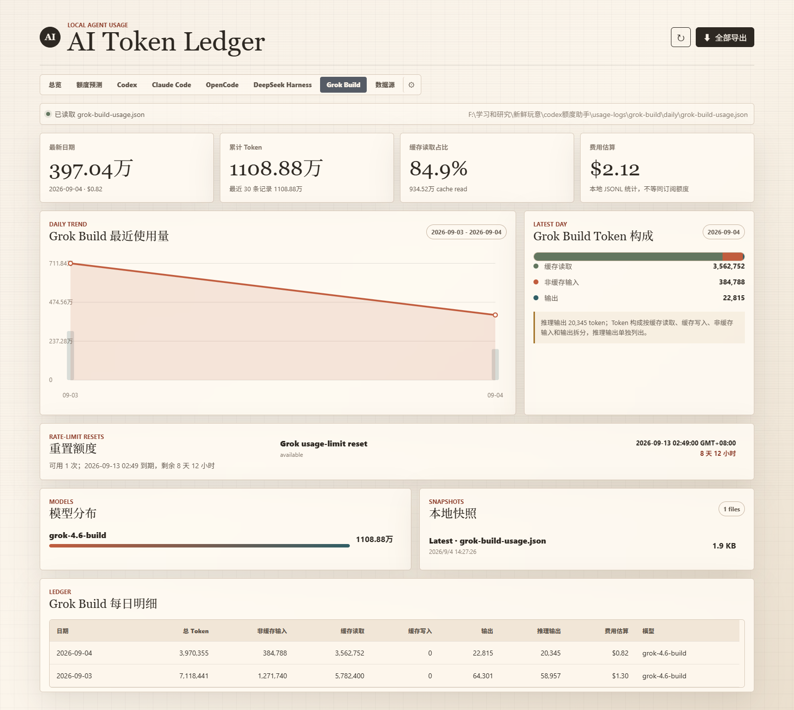
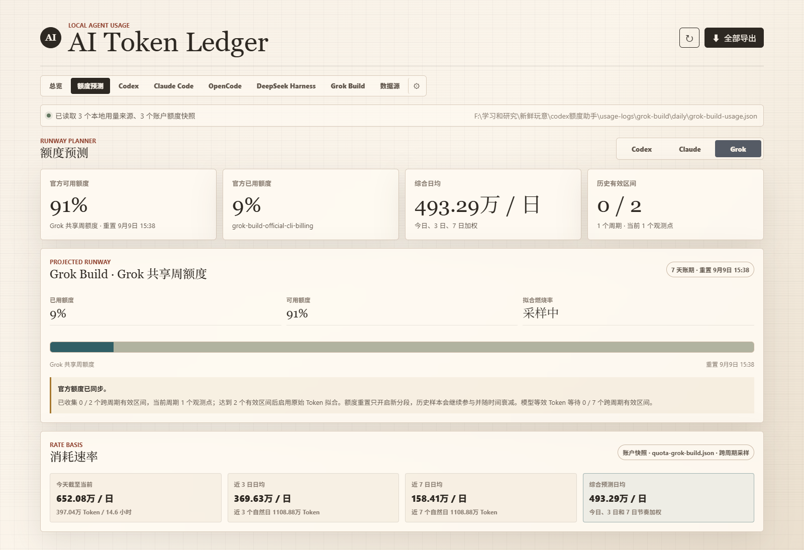
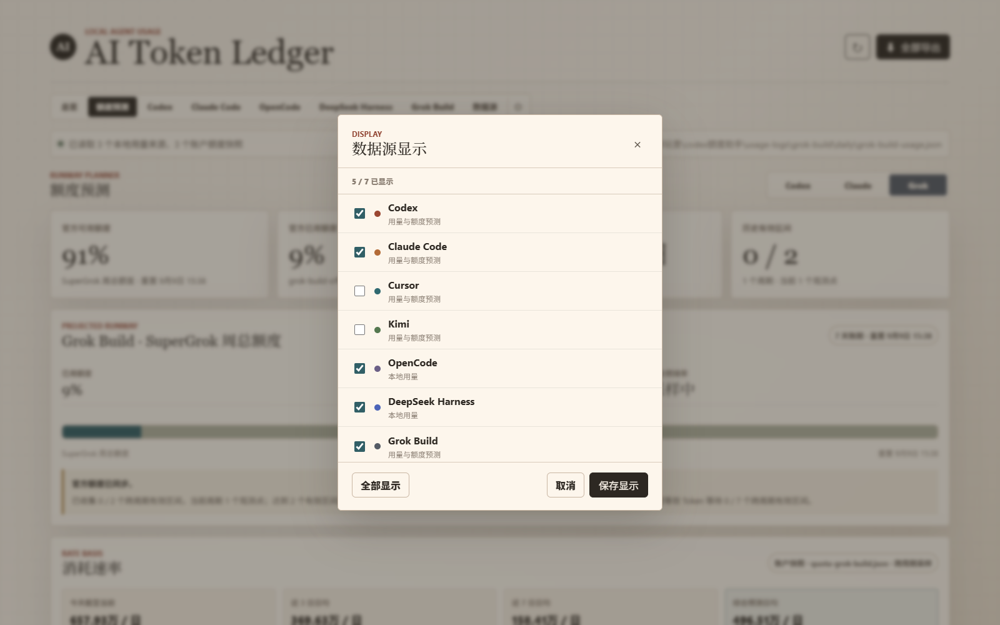
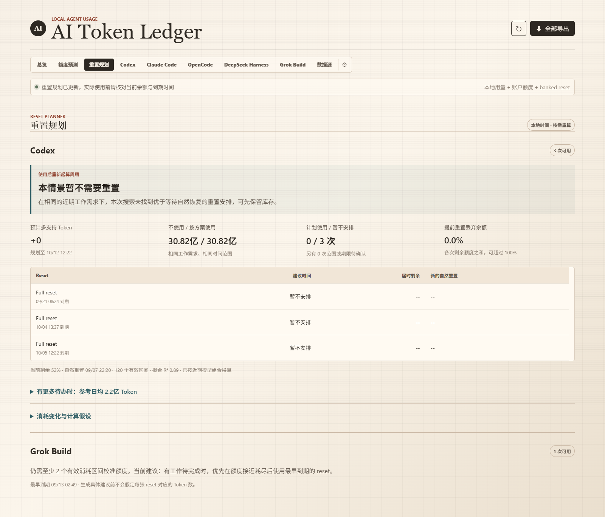
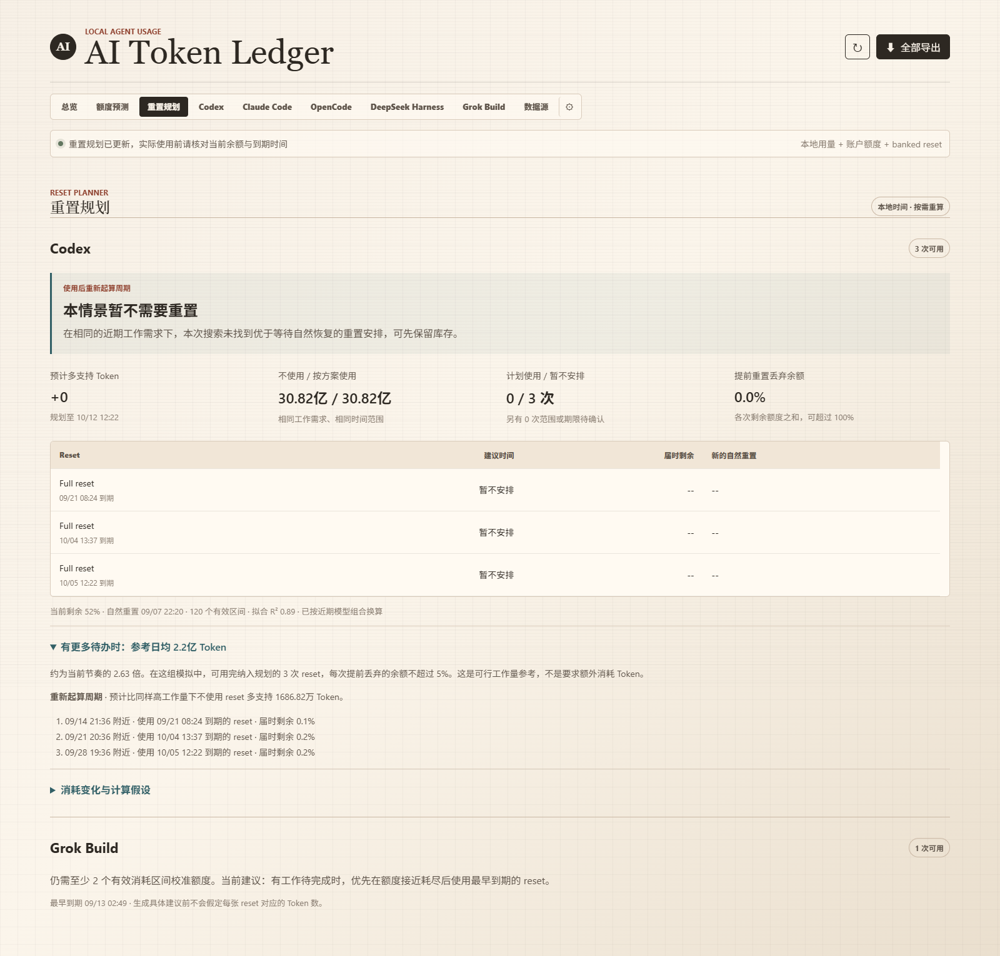
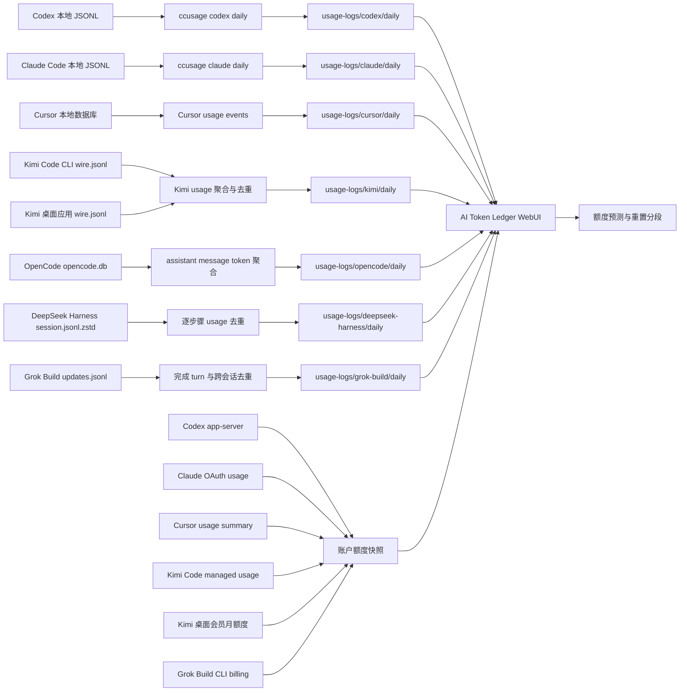

# AI Token Ledger

> 一个 Windows-first 的本地 AI coding agent 用量账本：统一查看 Codex、Claude Code、Cursor、Kimi、OpenCode、DeepSeek Harness 与 Grok Build 的 token 消耗、账户额度、重置时间和耗尽预测。

`AI Token Ledger` 将本机日志和账户额度快照放在同一个本地仪表盘里。它不需要数据库服务，不上传 usage JSON，也不会把每日导出和 `npx` 缓存写进 C 盘用户目录。

## 界面预览

以下截图来自本地聚合数据示例；数值会随账户和日志变化，截图不包含凭证、cookie 或账户 ID。

### 总览

所有已注册智能体的累计用量、近 30 日估算费用、模型分布、趋势、重置额度与每日明细集中在一页。


### Cursor Pro 额度预测

Cursor 页面使用设置页同口径的 `Included in Pro` 总百分比，并单独保留 `Auto + Composer` 与 `API` 分项；不会把旧计划单位误当成 Pro 额度百分比。


### Kimi 额度预测

Kimi 页面把会员月总额度和 Kimi Code 周额度注册为两个可切换窗口；每项都有自己的已用比例、重置时间、观测分段与耗尽预测。月度窗口还展示 Kimi / Code 构成，凭证读取完全在后端完成。5 小时窗口仍保存在原始账户快照中，但不进入预测页。


### OpenCode 本地用量

OpenCode 页面直接汇总本地 SQLite 中的 assistant token 字段，按 `provider/model` 区分不同后端，并保留非缓存输入、缓存读写、输出、推理与费用。采集器不会读取或导出对话正文。


### DeepSeek Harness 本地用量

DeepSeek Harness 页面只读扫描本地 `session.jsonl.zstd`，按会话、推理步骤和模型聚合 usage。流式 usage 会被同一步骤的最终 usage 替换，推理 token 作为输出子项单列，不重复计入总 token。


### Grok Build 本地用量

Grok Build 页面读取官方 CLI 会话中的 `turn_completed.usage`，自动拆分非缓存输入、缓存输入、输出和推理 token，并按模型汇总实际费用。恢复或分叉会话产生的重复 turn 会被去重，真实子代理调用仍会保留。额度预测页同步官方共享周池的已用百分比和重置时间，banked reset 只读展示可用次数与到期时间。





### 数据源显示设置

齿轮按钮可以选择导航、总览和预测页中关注的 Provider。隐藏只改变页面展示，后台全量刷新和历史快照仍会继续维护所有已注册来源。



### Banked reset 规划

根据当前额度、自然恢复日期、每张 reset 的到期时间和历史 Token 消耗，给出重置顺序与预计增益。近期需求不足以用完库存时，还可展开“有更多待办时”查看参考日均工作量与对应安排。





### 新版本提示

只有 GitHub 远端分支确认领先本地时才显示横幅；关闭后同一远端版本不会再次打扰。


### 移动端

手机端保持完整功能，顶部导航可横向浏览，不会把页面主体撑出视口。


## 能做什么

| 能力 | 说明 |
| --- | --- |
| 多来源用量账本 | 分别展示 Codex、Claude Code、Cursor、Kimi Code、OpenCode、DeepSeek Harness 与 Grok Build；总览由后端注册表动态聚合。 |
| 每日快照 | Codex / Claude Code / all-agent 使用 `ccusage`；Cursor 汇总 usage events；Kimi 汇总 `wire.jsonl`；OpenCode 汇总 SQLite；DeepSeek Harness 汇总 Zstandard 会话计量事件；Grok Build 汇总完成 turn。 |
| 官方额度窗口 | 同步 Codex、Claude Code、Cursor、Kimi 与 Grok Build 的当前已用比例、剩余额度、账期或重置时间。 |
| 统一刷新 | 顶部刷新和“全部导出”会刷新全部已注册本地 token 与账户额度源。 |
| 重点来源 | 可自行选择出现在导航、总览和预测页的 Provider；隐藏不停止后台刷新。 |
| 耗尽预测 | 结合今日实时速度、3 日、7 日速度，预测当前额度窗口的消耗节奏。 |
| 模型等效 Token | 样本足够时，从官方额度变化反向学习模型权重；不会拿 API 价格伪装成订阅额度换算。 |
| 日内重置识别 | 上午用完额度、午间重置、下午继续使用时，重置前后的 Token 会自动分段，避免污染拟合。 |
| 重置 credits | Codex 与 Grok Build 页可显示 banked reset 的可用次数与本地时区有效期；不会在仪表盘内消耗。 |
| 重置规划 | 对比等待自然恢复与使用 reset 的可支持 Token，展示逐张时间表、丢弃余额、三种消耗情景，以及有更多待办时的参考工作量。 |
| 新版本提示 | 页面打开时静默检查 GitHub；只有远端 `main` 严格领先本地提交时才显示可关闭提示。 |
| 定时导出 | Windows 计划任务默认每天中午 12:00 运行，即使晚间关机也不影响。 |

## 30 秒开始

### 1. 检查运行环境

当前项目面向 Windows 10/11，建议使用 Node.js 22.15 或更高版本、PowerShell，以及已经登录的 Codex / Claude Code / Cursor。Node 22.15 是读取 DeepSeek Harness Zstandard 会话日志所需的最低版本。Kimi 官方桌面应用和 Kimi Code CLI 的本地 token 都可读取；会员月总额来自已登录的 Kimi 桌面应用，周额度来自已登录的 Kimi Code CLI。OpenCode、DeepSeek Harness 与 Grok Build 是可选来源，只要已经生成对应本地日志即可。

```powershell
node --version
npx --version
```

本项目使用当前维护的 `ccusage` 命令。旧版 `@ccusage/codex` 用户无需卸载，但导出脚本会执行 `npx -y ccusage@latest`，首次运行时自动下载，无需全局安装。

```powershell
npx -y ccusage@latest codex daily --help
npx -y ccusage@latest claude daily --help
npx -y ccusage@latest daily --help
```

Kimi 是可选来源。只使用官方桌面应用时无需额外安装 CLI，每日 token 会从桌面应用的嵌入式 Kimi Code 日志读取，会员月总额及 Kimi / Code 构成会从桌面应用登录态同步；要同时显示 Kimi Code 周额度，安装 CLI 后运行一次登录即可。仪表盘不要求把 token 填进本项目。

```powershell
npm install -g @moonshot-ai/kimi-code
kimi login
```

OpenCode 默认读取[官方数据目录](https://opencode.ai/docs/troubleshooting/#storage)中的 `opencode.db`：

```powershell
Test-Path "$HOME\.local\share\opencode\opencode.db"
```

若数据库位于自定义目录，可在启动仪表盘前设置 `OPENCODE_DB_PATH`。OpenCode 可以连接多个模型 Provider，因此本项目只汇总本地 token 与费用，不虚构一个跨 Provider 的统一订阅额度窗口。

DeepSeek Harness 默认读取当前机器上的：

```powershell
Test-Path "D:\deepseek-harness\.dsh-home\sessions"
```

自定义安装可在启动仪表盘或执行导出前设置路径。`DEEPSEEK_HARNESS_SESSION_ROOT` 优先级最高；也可设置 Harness 项目根目录或 home：

```powershell
$env:DEEPSEEK_HARNESS_ROOT = "D:\deepseek-harness"
$env:DEEPSEEK_HARNESS_HOME = "D:\deepseek-harness\.dsh-home"
$env:DEEPSEEK_HARNESS_SESSION_ROOT = "D:\deepseek-harness\.dsh-home\sessions"
```

默认只统计路由标识为 `deepseek` 或 `deepseek-official` 的调用，避免把 Harness 中转到其他厂商的模型误记为 DeepSeek。确有自定义 DeepSeek 路由时，可用逗号分隔覆盖：

```powershell
$env:DEEPSEEK_HARNESS_PROVIDER_IDS = "deepseek,deepseek-official,my-deepseek-gateway"
```

Grok Build 默认读取官方 CLI 的 `~/.grok/sessions/**/updates.jsonl`。先运行一次 Grok Build 并完成至少一个 turn：

```powershell
grok --version
Test-Path "$HOME\.grok\sessions"
```

自定义 home 或会话目录可在启动和导出前设置。`GROK_BUILD_SESSION_ROOT` 优先于 `GROK_HOME`：

```powershell
$env:GROK_HOME = "D:\grok-home"
$env:GROK_BUILD_SESSION_ROOT = "D:\grok-home\sessions"
```

### 2. 导出第一份数据

```powershell
cd "F:\学习和研究\新鲜玩意\codex额度助手"
npm run export
```

也可以直接运行 PowerShell 脚本：

```powershell
powershell -NoProfile -ExecutionPolicy Bypass -File .\scripts\export-all-daily.ps1
```

### 3. 打开仪表盘

最简单的方式是双击项目根目录中的 `打开仪表盘.bat`，或在 PowerShell 中运行：

```powershell
powershell -NoProfile -ExecutionPolicy Bypass -File .\scripts\open-dashboard.ps1 -Port 8787
```

启动脚本会重启 `8787` 上已有的 AI Token Ledger Node 进程，确保新版前端与当前后端来自同一次启动；如果该端口属于其他应用，脚本会拒绝终止它并提示改用其他端口。

浏览器地址：<http://127.0.0.1:8787>

开发时也可以直接启动：

```powershell
npm start
```

## 工作原理



点击顶部刷新或“全部导出”时，系统固定按以下顺序执行：

1. 从后端注册表读取所有 `ccusage` 来源并导出当日 JSON。
2. 同步 Codex、Claude Code、Cursor、Kimi Code 的账户额度与本地事件来源，并导出 OpenCode、DeepSeek Harness 与 Grok Build 本地用量。
3. 记录去重后的分段观测点。
4. 重新读取当前页面；不管停留在哪个标签页，看到的都是同一轮数据。

## 页面说明

| 页面 | 适合查看的内容 |
| --- | --- |
| `总览` | 全部已注册来源的整体比较、总趋势、可滚动模型分布和每日总账。 |
| `额度预测` | 全部支持额度同步的 Provider 的剩余额度、重置时间、速度与耗尽预测。 |
| `重置规划` | 支持 banked reset 的来源的使用建议；与总览使用同一套数据源显示选择。 |
| `Codex` | Codex 的每日趋势、缓存构成、费用、模型、快照、reset credits。 |
| `Claude Code` | Claude Code 的每日趋势、缓存构成、费用、模型、快照。 |
| `Cursor` | Cursor usage events 汇总的独立 token 使用明细。 |
| `Kimi` | Kimi `usage.record` 的本地 token 明细、会员月额度构成和周额度。 |
| `OpenCode` | OpenCode assistant 消息的本地 token、费用和 `provider/model` 分布；不生成不存在的统一额度预测。 |
| `DeepSeek Harness` | Harness 会话中实际路由到 DeepSeek 的逐日 token、缓存、输出、推理与模型分布；不读取正文，也不虚构账户额度。 |
| `Grok Build` | Grok Build 完成 turn 的逐日 token、缓存、输出、推理、费用与模型分布，以及共享周额度和 banked reset 到期时间。 |
| `齿轮` | 选择显示在导航、总览和预测中的 Provider；至少保留一个，设置保存在本地。 |
| `数据源` | 日志目录、检测状态、每日快照和额度观测点数量。 |

页面首次打开只读取已有 JSON，不会自动执行 `npx`。需要最新数据时再点右上角刷新，避免每次打开浏览器都触发导出。

页面打开时还会请求本地 `/api/update-status`。后端使用 [GitHub Compare API](https://docs.github.com/en/rest/commits/commits#compare-two-commits) 判断远端 `main` 是否是本地提交的严格后继；网络中断、API 限流、仓库分叉、本地领先或无法读取 Git 状态时均保持静默。结果缓存 5 分钟。关闭提示后会按远端提交版本记忆，直到 GitHub 出现更新的提交才再次显示。

## 数据源与账户同步

| 来源 | 本地 token 数据 | 账户额度数据 | 自动周期 |
| --- | --- | --- | --- |
| Codex | `ccusage codex daily --json` | 本机 `codex app-server` 的 `account/rateLimits/read` | 周级及以上窗口；更短窗口只保留在原始快照 |
| Claude Code | `ccusage claude daily --json` | 本机 Claude OAuth 登录态请求 usage 窗口 | 7 天总额，以及接口实际开放的 Opus、Sonnet、Fable 等周级模型窗口 |
| Cursor | 最近 90 天 Cursor usage events 聚合 | Cursor usage summary | Cursor 账期、Included in Pro、Auto + Composer、API |
| Kimi | CLI `~/.kimi-code/sessions/**/wire.jsonl` + 桌面应用嵌入式 Kimi Code `sessions/**/wire.jsonl` | Kimi 会员 subscription stats + Kimi Code managed usage | 会员月总额及 Kimi / Code 构成、周额度与各自重置时间 |
| OpenCode | `~/.local/share/opencode/opencode.db` 中的 assistant token 字段 | 无统一账户口径 | 不生成额度窗口 |
| DeepSeek Harness | `.dsh-home/sessions/**/session.jsonl.zstd` 中的 usage 事件 | 未发现可验证的本机统一额度接口 | 不生成额度窗口 |
| Grok Build | `~/.grok/sessions/**/updates.jsonl` 中的 `turn_completed.usage` | 官方 CLI `_x.ai/billing` + Grok Web 只读 reset RPC | Grok 共享周池、重置时间、预付余额、banked reset |

### Codex

Codex 的额度来自本机 CLI 的 app-server，因此不会把 Codex 登录 token 返回给浏览器。页面还会读取 reset credits 的数量和有效期，但只展示汇总字段。

### Claude Code

Claude Code 的本地 token 明细来自 JSONL；额度窗口来自本机登录态。当前接口实际返回的每个 `utilization + resets_at` 对象都会自动注册，但预测页只显示周期不短于一周的窗口。全模型周限额始终优先；Fable/Opus/Sonnet 窗口只有在账户接口返回有效数据时才并列显示，不会用总额度伪造数值。模型专属窗口还可通过 `modelPatterns` 只累计相应模型的本地 token。后端会在 access token 临近过期或接口返回 401 时使用 Claude Code 自己的 refresh token 续期，并原子写回轮换后的凭证；如果 refresh token 已被撤销或其他进程轮换失效，则保留上一次成功快照并提示运行 `claude auth login`，不会清空历史数据。[Anthropic 的 Max 计划说明](https://support.claude.com/en/articles/11049741-what-is-the-max-plan)确认 Max 同时存在全模型周限额与模型专属周限额。

### Cursor Pro

Cursor 的旧 `plan.used / plan.limit` 单位与“Included in Pro”百分比不是同一件事。项目将设置页同口径的总百分比作为主要额度进度，同时展示 `Auto + Composer`、`API` 和账期；旧单位只作为诊断数据保留，不参与 Pro 百分比预测。

### Kimi

Kimi token 明细同时扫描 CLI 与官方桌面应用的本地会话，只累计 turn 级 `usage.record`，缓存读取、缓存写入、普通输入和输出分别聚合。`session` 级汇总不会再次计入；相同事件若同时出现在两套目录，会按时间、模型和 token 构成跨来源去重，主代理与子代理各自真实发生的调用仍会保留。

桌面应用日志位于 `%APPDATA%\kimi-desktop\daimon-share\daimon\runtime\kimi-code\home\sessions`。会员月总额通过 Kimi Web 与桌面应用共用的 `GetSubscriptionStats` 接口读取，使用桌面应用自己的登录态，只保留总已用比例、Code 占比和精确到时分的到期时间；面板中的“月度 Kimi”由总比例减去 Code 比例得到。Kimi Code 周额度来自 CLI managed usage 接口，过期 CLI access token 会使用官方 OAuth refresh 流程在本机刷新，并原子更新 Kimi 自己的凭证文件。

两套在线额度相互独立降级：未安装 Kimi Code CLI 时仍可显示会员月总额；Kimi 桌面应用未登录或登录态过期时仍可显示 CLI 的周额度。在线额度查询失败也不影响本地每日 token 导出，面板会保留最近一次成功的额度快照。任何 token、cookie、完整账户 ID 或会话正文都不会返回 WebUI 或写入项目日志。[Kimi 会员额度规则](https://www.kimi.com/zh-cn/help/membership/membership-update-rules)说明月额度按订阅周期恢复；[Kimi Code 权益说明](https://www.kimi.com/zh-cn/help/kimi-code/benefits)说明另有周额度和 5 小时滚动窗口，但预测页只保留周额度及以上口径。

### DeepSeek Harness

采集器按 Harness 自己的持久化协议扫描由多个独立 Zstandard frame 拼接而成的会话文件。每个 `(session, turn, step)` 只保留最后一份 usage：正常完成时以 `assistant/message.usage` 为准；请求中断但已经产生 usage chunk 时保留该早期样本。总 token 按普通输入、输出、缓存读取和缓存写入相加，`reasoningTokens` 是输出的子项，只单独展示而不重复累加。

解析结果只含日期、Provider、模型和 token 数字。会话 ID、工作目录、请求头正文、用户消息、助手文本和工具内容均在解析时丢弃，不会写入 `usage-logs`。活动文件末尾若存在未完成 frame，会保留此前完整 frame 并跳过残缺尾部；单个损坏文件不会阻止其他会话统计，但所有文件均不可解码时导出会失败并保留旧账本。

DeepSeek Harness 目前作为纯本地用量来源接入。没有经过验证的官方账户额度百分比与重置时间接口，因此页面不会凭 token 数量伪造额度或耗尽预测。

### Grok Build

Grok Build 采集器依据[官方会话持久化说明](https://github.com/xai-org/grok-build/blob/main/crates/codegen/xai-grok-pager/docs/user-guide/17-sessions.md)，递归扫描 `~/.grok/sessions` 下所有 `updates.jsonl`，只接受 `sessionUpdate: "turn_completed"` 的最终 usage。它不会使用 `signals.json` 中用于上下文恢复的 token 快照，也不会解析用户消息、助手正文或工具内容。[Grok Build 官方仓库](https://github.com/xai-org/grok-build)与[产品说明](https://x.ai/news/grok-build-cli)可用于核对 CLI 与本地会话格式。

xAI 的 `inputTokens` 含缓存输入，因此页面先减去 `cachedReadTokens` 和 `cacheCreationTokens`，再把剩余部分显示为“非缓存输入”；`reasoningTokens` 是输出的子项，只单列而不重复加入总 token。`costUsdTicks` 按固定点美元换算后保留在每日账本中。若同一个 prompt/model 因恢复、导入或分叉出现在多个会话文件中，只保留最新且最完整的一份；不同 prompt 的父会话和子代理调用都会计入。

额度刷新通过官方 CLI 的 `_x.ai/billing` 扩展完成，读取 `creditUsagePercent` 和 `currentPeriod`，不直接处理 CLI access token。[xAI FAQ](https://docs.x.ai/grok/faq)说明这是 Grok 各产品共享的周使用池，页面显示的百分比并非 Build token 的一对一比例；如果同一周期还使用 Grok Chat、Imagine、Voice 或 API，这些消耗也会推动周池百分比，拟合结果会如实反映这种混合行为。

banked reset 通过 Grok Web 自身的 `ConsumerUiSvc/GetRemainingResets` 只读 RPC 获取。仪表盘只保留可用数量和最早到期时间，reset token ID 在内存解析阶段丢弃，也不提供兑换按钮。点击顶部刷新会同时更新周额度、预测观测点和 banked reset；手动在 Grok 官方页面使用 reset 后，下一次刷新会检测已用比例下降或周期变化并开启新分段，旧周期拟合样本不会被删除。

持久化结果只含日期、模型、usage 数字、额度百分比和 reset 到期时间，不含 prompt ID、reset token ID、会话 ID、工作目录、对话正文或凭证。

## 额度预测：原始 Token、模型等效 Token 与重置

### 为什么不直接按 API 价格换算？

不同模型、缓存命中、上下文规模、任务形态都会影响订阅额度的内部扣减。API 价格可用于成本估算，但不等同于 Codex、Claude 或 Cursor 的订阅限额消耗。因此，面板不会把 API 单价硬编码为“额度 Token 权重”。

### 预测分层

| 阶段 | 条件 | 面板行为 |
| --- | --- | --- |
| 观察期 | 历史不足 2 个有效消耗区间 | 显示官方额度、重置时间、今日 / 3 日 / 7 日原始 Token 速度。 |
| 单变量拟合 | 历史累计至少 2 个有效区间 | 汇总保留期内各重置周期的 Token 增量和额度百分比增量，显示 `R²` 与预测耗尽时间。 |
| 模型等效 Token | 至少 7 个跨周期有效区间，且模型占比存在显著变化 | 使用岭回归反向学习模型相对权重；权重受先验与 `0.25x - 4x` 范围约束。 |

单变量拟合采用“分段固定起点”：每个额度周期只计算周期内部增量，避免把重置前后的百分比跳变当作消耗；随后把同一种额度窗口的所有有效区间合并学习同一条燃烧率。旧数据不会因重置被删除，而是按 28 天半衰期逐渐降低权重，近期使用习惯更能影响预测。周额度、月额度或其他不同口径不会跨窗口混合拟合，接口新增更长周期窗口时会先重新积累该口径的样本。异常区间还会通过稳健权重降权。

如果样本不足、模型一直不变、模型混合没有足够变化，或加权拟合质量更差，系统会自动退回原始 Token 单斜率。这里的“模型等效 Token”只对当前账户和当前保留期内的观测数据有效，不是官方公开换算率。

### 如果额度在一天内被重置

每次有效刷新都会为当前 Provider 的所有可选额度窗口分别写入紧凑观测点，记录窗口名、已用比例、重置时间、对应累计 Token 和分模型汇总。默认只把周级及以上窗口纳入预测；月、周及模型专属窗口各自维护观测和重置分段。下列任一情况会自动切换到新分段：

- `resetsAt` 变化超过 5 分钟；
- 官方已用百分比下降超过 0.5 个百分点；
- 本地累计 Token 计数回退。

因此“上午用完，午间重置，下午继续跑”的 Token 不会和上午额度消耗混在同一条拟合曲线上。5 分钟容差用来吸收部分账户接口返回的毫秒级重置时间抖动。

开启新分段不等于从头拟合。重置前已经形成的有效区间仍会用于估计燃烧率；新周期的已用比例、剩余比例和截止时间只负责当前状态。即使新周期暂时只有一个观测点，只要历史已有两个有效区间，面板也可以立即给出预测。

同一天可以连续创建多个重置分段，并不只支持一次重置。每日观测文件仍限制为 96 条；超过限制时会优先保留每个额度窗口的首尾点、每个分段的边界和重置点，再用较新的普通观测填满剩余位置，避免短窗口的高频刷新挤掉月/周窗口证据。

重置识别依赖同步时看到的账户状态。若两次重置都完整发生在相邻两次同步之间，并且最终已用比例、累计 Token 与 `resetsAt` 没有留下可观察跳变，任何本地快照方案都无法事后还原中间边界。手动使用 reset credit 后，建议尽快点击页面右上角刷新，确保新周期至少留下一个观测锚点。

完整设计说明见：[额度等效 Token 与重置分段设计](docs/plans/2026-07-10-quota-equivalent-token-design.md)。

## 重置规划：何时使用 banked reset

点击顶部 **重置规划**，或在 Codex / Grok 的重置额度栏点击 **查看重置规划**。页面自动读取可用次数、逐张到期时间、周额度与已有预测模型，不需要手工填写 Token 上限。

### 如何读建议

- **近期节奏方案**：依据今日、3 日、7 日加权速率和历史额度拟合，给出建议时间、预计届时剩余百分比、使用后的自然重置时间。
- **预计多支持 Token**：同一时间范围、同一工作量下，相比完全等待自然恢复能额外支持多少 Token。不是增加的现金余额，也不代表任务质量。
- **暂不安排**：当前模拟中，额外消耗 reset 没有更高收益。保留库存并随使用变化重算即可；库存过期不等于损失了本来就需要的工作量。
- **有更多待办时**：在当前速率的 1–8 倍范围搜索可行参考工作量，要求用完纳入规划的 reset，且每次丢弃余额不超过 5%；找不到满足条件的方案就不展示。页面同时列出该情景的时间表。它只适用于确实有更多有价值工作的情况，不代表消耗越高、工作价值就越大。
- **消耗变化与计算假设**：分别模拟 0.7×、1×、1.3× 消耗；这些是敏感性分析，不是概率或置信区间。

### 计算规则

算法按半小时时间点推进，额外加入自然恢复时刻和到期前约 1 小时的操作边界。每个节点考虑“继续使用当前余额”或“使用最早到期的可用 reset”，保留若干具有不同剩余量与下一次恢复时间的候选，最终比较可支持的总工作量。它是有限候选的近似优化，不保证连续时间下的数学全局最优；候选中始终保留“不使用 reset”，收益相同时优先少消耗 reset。

reset 会补满当前窗口，不会把原余额与一整份新额度相加。自然恢复同样不会积累未用余额。可以一天使用多次 reset，但必须有足够工作需求消耗新额度。到期只约束兑换时刻，所以规划延伸到最后一张已知 reset 到期后一个额度周期，以考虑到期前补满、到期后继续用的情况。最多规划未来 60 天、24 张可识别 reset，其余明确标注并留待下一轮。

[OpenAI 的 banked reset 说明](https://help.openai.com/en/articles/20001498-how-banked-codex-resets-work)明确：Full reset 会恢复 5 小时与周额度，并改变周重置日期。因此 Codex 按使用后重新起算窗口估算，假定重置后立即开始工作。Grok 的现有只读接口没有确认周期变更规则，页面分别展示“保留原重置日”和“重新起算周期”两种情景，主表标明采用的假设。

每日 Token 被均匀分摊到小时，没有从日总量推断睡眠或开工时间。近期模型等效权重可用于额度速率，最终收益换回近期模型组合下的原始 Token。周额度之外的短时限流、其他设备或共享产品消耗可能降低实际收益。使用前以当前官方余额为准，使用后刷新以读取新的恢复时间。

### 数据不足与刷新

只有库存数量与明细一致、到期时间和重置类型可识别、Token 与额度快照不超过 6 小时、两者采集时间相差不超过 1 小时且至少存在 2 个有效拟合区间时，才计算具体时间表。拟合 R² 低于 0.3 时暂不输出数值建议。缺失时间、未知 reset 类型、过期、已兑换的记录不被虚构成可用完整周额度。

顶部刷新会继续执行全数据源导出和账户同步，然后重新计算规划。每日定时导出仍维护同一批输入，下次进入页面即按新快照分析。历史观测不会被规划修改；不写额外逐次计划文件，也不会调用兑换接口。计算在 Web Worker 中完成，较大的 reset 库存不会阻塞页面操作。

设计与边界见 [重置规划设计](docs/plans/2026-09-05-banked-reset-planner.md)。

## 扩展新的智能体

Provider 定义统一放在后端 [`providers/registry.js`](providers/registry.js)。前端不会包含一份平行的智能体名单，而是从 `/api/providers` 读取经过筛选的名称、颜色和能力标记，自动生成导航、总览卡片、独立用量页和预测标签。

如果新工具能复用现有采集方式，只需在注册表增加一个条目并填写以下后端字段：

| 字段 | 用途 |
| --- | --- |
| `id / label / color` | 稳定标识与展示信息。 |
| `detectPaths` | 判断本机是否安装或登录。 |
| `usage.adapter` | `ccusage`、账户事件、本地 wire 日志或 SQLite 适配器。 |
| `usage.filePrefix / logRoot` | 每日覆盖快照的文件名和目录。 |
| `quota.adapter` | 官方账户额度规范化适配器。 |
| `quota.discoverWindows` | 是否自动接纳接口中新出现的有效额度窗口。 |
| `quota.minimumForecastWindowMins` | 预测页与观测记录接受的最短周期，当前内置 Provider 使用 `10080`（一周）。 |
| `quota.windows[]` | 已知窗口的后端模板：名称、标签、周期类型、选择状态和模型过滤。 |
| `forecast / navigation` | 是否生成预测和独立页面。 |

额度窗口模板示例：

```js
quota: {
  adapter: "claude-oauth",
  discoverWindows: true,
  minimumForecastWindowMins: 10080,
  windows: [
    { name: "seven_day", label: "周总额度", windowDurationMins: 10080, windowKind: "weekly" },
    {
      name: "seven_day_fable",
      label: "Fable 周额度",
      windowDurationMins: 10080,
      windowKind: "weekly",
      modelPatterns: ["fable"],
    },
  ],
}
```

`selectable: false` 可把构成项保留在快照中但不生成独立预测标签，例如 Cursor 的 `Auto + Composer` 与 `API`。没有写入模板、但接口返回有效利用率和重置时间的新窗口会使用字段名生成默认标签并自动进入前端；确认口径后再在模板补上中文名和 `modelPatterns` 即可。

如果协议完全不同，只需在 `scripts/sync-account-quotas.mjs` 的后端 adapter map 新增采集函数，再在注册表引用它；无需增加新的用量页前端分支。OpenCode 和 DeepSeek Harness 是 `forecast: false`、`quota: null` 的纯本地用量模板示例；Grok Build 则示范同一 Provider 同时返回本地 usage 与在线 quota。注册表返回给浏览器的对象由 `publicProvider()` 白名单生成，不含凭证路径、接口地址、命令参数、窗口模板或 adapter 名称。

Provider 数量增加后不需要删注册项。页面齿轮中的显示设置会把隐藏选择写入 `usage-logs/display-settings.json`；未显示的 Provider 仍参与全量导出，重新勾选后历史立即可见。以后新注册的 Provider 默认自动显示，再由用户决定是否隐藏。

支持 banked reset 的 Provider 还可以在后端注册表增加规划策略，前端不增加配置表单：

```javascript
resetCredits: true,
resetPlanning: {
  cycleMode: "restart", // restart / fixed / unknown
  windowNames: ["weekly_limit"],
  creditTitles: ["Full reset"],
},
```

`restart` 表示使用后重新起算周期，`fixed` 表示保留原自然恢复日，`unknown` 同时比较两种情景。先为 `/api/reset-credits?source=...` 接入相应的只读库存适配器，返回脱敏后的 `status/title/expires_at_ms`；规划页会按注册的窗口和 reset 类型自动加入来源。尚未确认作用范围时不要注册一个猜测的策略。

## 每日自动导出

默认建议每天中午 12:00 导出，避开晚间关机。

```powershell
powershell -NoProfile -ExecutionPolicy Bypass -File .\scripts\register-daily-task.ps1 -At 12:00 -Timezone Asia/Tokyo
```

如果已有任务需要覆盖：

```powershell
powershell -NoProfile -ExecutionPolicy Bypass -File .\scripts\register-daily-task.ps1 -At 12:00 -Timezone Asia/Tokyo -Force
```

旧版用户若机器上已有 `CodexUsageDailyExport`，可以原地替换为全量同步任务：

```powershell
powershell -NoProfile -ExecutionPolicy Bypass -File .\scripts\register-daily-task.ps1 `
  -TaskName CodexUsageDailyExport `
  -At 12:00 `
  -Timezone Asia/Tokyo `
  -Force
```

查看任务：

```powershell
Get-ScheduledTaskInfo -TaskName AITokenLedgerDailyExport
```

删除任务：

```powershell
Unregister-ScheduledTask -TaskName AITokenLedgerDailyExport -Confirm:$false
```

如果你使用旧任务名，请把上面两条命令中的任务名替换为 `CodexUsageDailyExport`。

## 常用命令

```powershell
# 运行单元测试
npm test

# 导出全部本地 token 数据并同步账户额度
npm run export

# 只导出 Codex / Claude / all-agent JSON
npm run export:codex
npm run export:claude
npm run export:all

# 只同步 Kimi 本地 token 与账户额度
npm run export:kimi

# 只同步 OpenCode 本地 token
npm run export:opencode

# 只同步 DeepSeek Harness 本地 token
npm run export:deepseek-harness

# 同步 Grok Build 本地 token、周额度和 banked reset
npm run export:grok-build

# 启动本地 WebUI
npm start
```

默认 `ccusage` 导出时区是 `Asia/Tokyo`。如果希望改为上海时区：

```powershell
powershell -NoProfile -ExecutionPolicy Bypass -File .\scripts\export-all-daily.ps1 -Timezone Asia/Shanghai
```

## 本地文件与存储控制

```text
usage-logs/
├─ codex/daily/codex-usage.json       # Codex 完整每日历史滚动文件
├─ claude/daily/claude-usage.json     # Claude Code 完整每日历史滚动文件
├─ cursor/daily/cursor-usage.json     # Cursor events 完整每日历史滚动文件
├─ kimi/daily/kimi-usage.json         # Kimi wire 完整每日历史滚动文件
├─ opencode/daily/opencode-usage.json # OpenCode SQLite 完整每日历史滚动文件
├─ deepseek-harness/daily/deepseek-harness-usage.json # Harness 完整每日历史滚动文件
├─ grok-build/daily/grok-build-usage.json # Grok Build 完整每日历史滚动文件
├─ all/daily/all-usage.json           # all-agent 完整每日历史滚动文件
├─ display-settings.json        # 本地 Provider 显示选择
├─ forecast-settings.json       # 预测页本地设置
├─ quota-snapshots/             # 每来源一个额度文件，内含最新值和每日历史
├─ quota-observations/          # 每来源一个观测文件，内含 120 天重置分段历史
```

存储策略：

- 每个数据源只保留一个 token 滚动 JSON；刷新时会把旧账本与新导出按日期合并，`daily` 历史永久保留并据此重算累计 `totals`，统计与图表读取方式不变。
- 同一天多次刷新时，后一次导出的当日累计值替换前一次，不会把同一天重复相加；日内速率点仍由额度 `observations` 单独记录。
- 每个有账户额度的数据源只保留一个额度 JSON，其中 `latest` 是最新状态，`history` 是最近 120 天每日快照。
- 每个有账户额度的数据源只保留一个观测 JSON，其中 `observations` 保留最近 120 天的去重观测点和重置分段边界。120 天清理仅作用于额度拟合观测，不删除 Token 日账本。
- 所有滚动文件都先写临时文件再原子替换。只有新文件写入成功后，程序才会删除旧的日期命名文件；导出失败时旧数据保持不动。
- 第一次使用新版刷新时会自动合并旧文件，无需手工迁移。合并只改变物理文件组织，不改变预测拟合、重置分段或模型换算逻辑。
- `npx` 缓存：默认位于项目内的 `.npm-cache`。
- 所有上述运行数据都在 `.gitignore` 中，不会被提交到 GitHub。

旧的 `codex-usage-logs/daily` 仍可作为迁移前读取 fallback；Codex 成功导出后会写入 `usage-logs/codex/daily/codex-usage.json` 并清理严格匹配的旧日期快照。

## 隐私与统计边界

### 不会写入项目或提交的内容

- Codex / Claude / Cursor / Kimi / OpenCode / DeepSeek Harness / Grok Build 的 access token、refresh token、API key、cookie；
- 邮箱、完整账户 ID、会话内容、原始 Cursor events、OpenCode message 正文、Harness message/tool 正文、Grok Build prompt ID 或 reset token ID；
- `usage-logs/`、`codex-usage-logs/`、`.npm-cache/`、`verification/`、`node_modules/`。

账户凭证只在本机内存中，用于向对应服务读取自己的账户用量；本地 WebUI 不会把它们返回给浏览器。

### 这个项目回答什么问题

它很适合回答：

> 我这台机器上的 Codex / Claude Code / Cursor / Kimi Code / OpenCode / DeepSeek Harness / Grok Build，最近每天消耗了多少 token？有官方额度的来源还剩多少？按现在速度能用多久？

它不能保证：

> 本地 token 总数与订阅产品内部扣减绝对相等。

官方内部扣减仍可能受 plan、模型、缓存、上下文、任务复杂度、云端执行与平台策略影响。预测页优先展示官方额度比例和重置时间；本地 token 用于解释速度与趋势。

## 常见问题

### 页面显示没有数据

先运行一次全量导出：

```powershell
npm run export
```

然后刷新 <http://127.0.0.1:8787>。

### Claude Code 页没有 token 数据

检查本机日志和 `ccusage`：

```powershell
Test-Path "$HOME\.claude"
npx -y ccusage@latest claude daily --json
```

如果命令本身没有数据，WebUI 也不会有 Claude Code 明细。

### 账户额度同步失败

常见原因是网络不可用、CLI 未登录、OAuth refresh token 已被撤销，或账户接口结构调整。面板会保留最近成功快照；重新登录相应客户端后点击顶部刷新即可重试。Claude 显示“需重新登录”时运行 `claude auth login --claudeai`；普通 access token 过期会由后端自动续期，无需重复登录。Kimi 可运行 `kimi login` 重新建立登录态；即使在线额度失败，本地每日 token 仍会正常导出。

### Kimi 今天的 token 没出现

先确认至少一套本地会话目录存在，再单独刷新 Kimi：

```powershell
Test-Path "$HOME\.kimi-code\sessions"
Test-Path "$env:APPDATA\kimi-desktop\daimon-share\daimon\runtime\kimi-code\home\sessions"
npm run export:kimi
```

输出文件是 `usage-logs\kimi\daily\kimi-usage.json`。每次刷新原子替换同一个滚动文件，文件内仍包含逐日历史，不会随刷新次数增加文件数量。

### OpenCode 今天的 token 没出现

先确认数据库存在，再单独同步：

```powershell
Test-Path "$HOME\.local\share\opencode\opencode.db"
npm run export:opencode
```

输出文件是 `usage-logs\opencode\daily\opencode-usage.json`。采集器优先按 assistant message 聚合；若当前数据库版本没有可用 message token，才回退到 session 累计字段。每次刷新原子替换同一个滚动文件。

### DeepSeek Harness 今天的 token 没出现

先检查 Node 版本、默认会话目录和单独导出：

```powershell
node --version
Test-Path "D:\deepseek-harness\.dsh-home\sessions"
npm run export:deepseek-harness
```

要求 Node.js `>=22.15`。输出文件是 `usage-logs\deepseek-harness\daily\deepseek-harness-usage.json`。如果 Harness 使用自定义 home，请先设置 `DEEPSEEK_HARNESS_HOME` 或 `DEEPSEEK_HARNESS_SESSION_ROOT`；如果使用自定义 DeepSeek 路由名，再设置 `DEEPSEEK_HARNESS_PROVIDER_IDS`。顶部刷新与每日定时任务都会调用同一采集器。

### Grok Build 今天的 token 没出现

先确认 CLI 已经完成至少一个 turn，并单独导出：

```powershell
grok --version
Test-Path "$HOME\.grok\sessions"
npm run export:grok-build
```

输出文件是 `usage-logs\grok-build\daily\grok-build-usage.json`。采集器只统计已落盘的 `turn_completed`；正在运行且尚未完成的 turn 会在结束后的下一次刷新中出现。额度读取还要求本机 Grok CLI 已登录；若周额度同步提示凭证问题，请先运行 `grok login`。顶部刷新、全部导出与每日定时任务都会同步 token、周额度与 banked reset。

### 端口 8787 被占用

```powershell
powershell -NoProfile -ExecutionPolicy Bypass -File .\scripts\start-webui.ps1 -Port 8790
```

然后访问 <http://127.0.0.1:8790>。

### 双击脚本后窗口闪退

在 PowerShell 中运行即可看到错误：

```powershell
powershell -NoProfile -ExecutionPolicy Bypass -File .\scripts\open-dashboard.ps1 -Port 8787
```

重点检查 Node.js 是否安装、版本是否至少为 22.15，以及 `node` 是否在 `PATH` 中。

## 项目结构

```text
.
├─ 打开仪表盘.bat
├─ open-dashboard.bat
├─ package.json
├─ server.js
├─ README.md
├─ lib/
│  ├─ display-settings.js
│  └─ update-check.js
├─ providers/
│  └─ registry.js
├─ docs/
│  ├─ assets/
│  └─ plans/
├─ scripts/
│  ├─ export-all-daily.ps1
│  ├─ export-daily.ps1
│  ├─ open-dashboard.ps1
│  ├─ provider-config.mjs
│  ├─ register-daily-task.ps1
│  ├─ start-webui.ps1
│  └─ sync-account-quotas.mjs
├─ tests/
│  ├─ display-settings.test.js
│  ├─ forecast-model.test.js
│  ├─ provider-registry.test.js
│  └─ update-check.test.js
└─ web/
   ├─ app.js
   ├─ forecast-model.js
   ├─ index.html
   └─ styles.css
```

## 开发与验证

```powershell
npm test
node --check server.js
node --check web/app.js
node --check web/forecast-model.js
```

测试覆盖模型等效 Token、模型混合不可辨识时的降级、同日多窗口观测、额度重置分段、Provider 元数据脱敏、Claude 动态窗口与模型过滤、Kimi CLI/桌面事件合并去重、OpenCode 多模型聚合、DeepSeek Harness 多 frame 解码与逐步骤去重、Grok Build 缓存输入拆分与跨会话去重，以及显示设置的过滤与最少一个来源约束。
